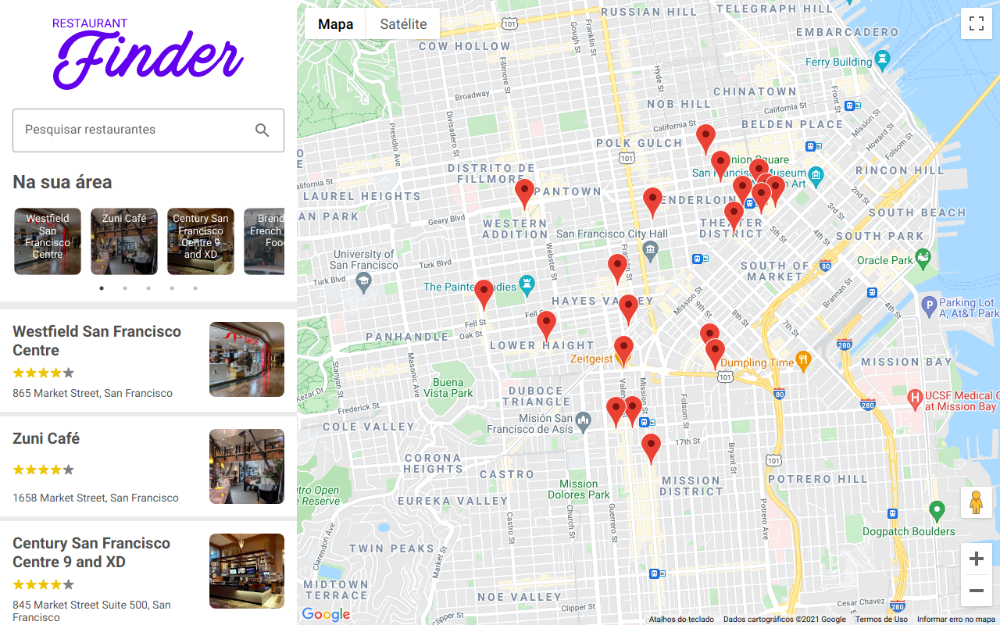

<h1 align="center">
  
</h1>

  <a href="#-tecnologias">Tecnologias</a>&nbsp;&nbsp;&nbsp;|&nbsp;&nbsp;&nbsp;
  <a href="#-projeto">Projeto</a>&nbsp;&nbsp;&nbsp;|&nbsp;&nbsp;&nbsp;
  <a href="#-funcionalidades">Funcionalidades</a>

 

  

## 🧪 Tecnologias

Esse projeto foi desenvolvido com as seguintes tecnologias:

- [ReactJS](https://reactjs.org/)
- [Styled-Components](https://styled-components.com/)
- [Redux](https://redux.js.org/)

## 💻 Projeto

Este projeto foi feito durante o curso "Criando um site para encontrar restaurantes usando Google Maps que consulta API do Google", do Bootcamp [LocalizaLabs React Developer](https://web.digitalinnovation.one/track/localizalabs-react-developer), pela plataforma [Digital Innovation One](https://web.digitalinnovation.one/home).

## 💣 Funcionalidades

- Conexão com a API do Google, obtendo acesso à Google Places API e à Google Maps API.
- Busca automática de restaurantes próximos baseado na localização do usuário.
- Busca de restaurantes por texto.
- Modal que exibe detalhes do restaurante selecionado
- Componentes de Skeleton Loading que melhoram a experiência do usuário.

---

<h4 align="center"> Feito com ♥ por Marcelino Teixeira </h4>
